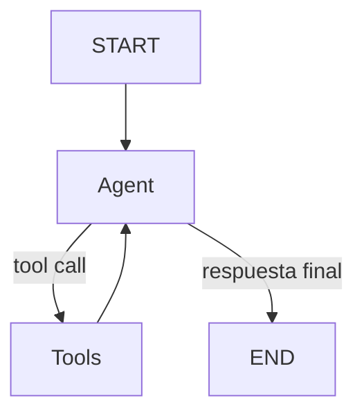

# entrega-5-agente-react
pre-entrega-5-agente-react
# Agente ReAct con memoria persistente

Pre-entrega 5 del curso de AI Engineering.

Este proyecto implementa un agente de razonamiento cíclico utilizando LangGraph. El agente puede decidir de forma autónoma cuándo utilizar herramientas, ejecutar consultas sobre una base de datos simulada y mantener el contexto de una conversación mediante persistencia en SQLite.

## Arquitectura

El agente utiliza `MessagesState` como estado compartido y un `StateGraph` compuesto por:

- Un nodo `agent`, encargado del razonamiento mediante un LLM.
- Un nodo `tools`, encargado de ejecutar las herramientas.
- `tools_condition`, que decide si el agente debe utilizar una herramienta o finalizar.
- Un ciclo de retorno desde `tools` hacia `agent` para implementar el patrón ReAct.
- `SqliteSaver` para persistir el estado utilizando un `thread_id`.



## Herramienta personalizada

El proyecto incluye la herramienta:

`buscar_pedidos(cliente_id)`

La herramienta simula una consulta a una base de datos de clientes y permite obtener:

- cantidad de pedidos;
- monto total gastado;
- fechas de los pedidos;
- identificadores de los pedidos.

Los datos utilizados para la demostración se encuentran en:

`data/orders.json`

## Instalación

El proyecto requiere Python 3.12 o superior.

Crear un entorno virtual:

```bash
python3.12 -m venv .venv
source .venv/bin/activate
```

Instalar las dependencias:

```bash
python -m pip install -r requirements.txt
```

## Variables de entorno

Crear un archivo `.env` tomando como referencia `.env.example`:

```env
GROQ_API_KEY=your_groq_api_key_here
LLM_MODEL=openai/gpt-oss-20b
```

Las credenciales reales no deben incluirse en el repositorio.

## Ejecución

Ejecutar:

```bash
python main.py
```

La demostración realiza una consulta que requiere comparar dos clientes.

El agente debe consultar de forma autónoma:

```text
buscar_pedidos(cliente_id=102)
buscar_pedidos(cliente_id=205)
```

Luego realiza una segunda interacción utilizando el mismo `thread_id` para comprobar la persistencia del contexto.

Se utiliza:

```text
thread_id = demo-cliente-1
recursion_limit = 10
```

## Persistencia

El grafo utiliza `SqliteSaver`.

Los checkpoints se almacenan localmente en `agent_memory.db`. Este archivo no se incluye en Git porque se genera durante la ejecución.

Al reutilizar el mismo `thread_id`, LangGraph recupera el estado anterior de la conversación.

## Traza ReAct

Una ejecución real se encuentra documentada en:

`traces/react_trace.json`

Durante la ejecución registrada, el agente realizó el siguiente ciclo:

```text
Usuario
  ↓
Agent
  ↓
buscar_pedidos(cliente_id=102)
  ↓
Tool result
  ↓
Agent
  ↓
buscar_pedidos(cliente_id=205)
  ↓
Tool result
  ↓
Agent
  ↓
Respuesta final
```

Posteriormente se realizó una segunda pregunta con el mismo `thread_id`:

```text
¿Y cuál fue el último pedido del cliente que gastó más?
```

El agente mantuvo el contexto de la interacción anterior mediante los checkpoints persistidos en SQLite.

## Tests

Ejecutar:

```bash
python -m pytest -v
```

Resultado de la ejecución validada:

```text
3 passed
```

Los tests verifican:

- consulta del cliente 102;
- consulta del cliente 205;
- manejo de un cliente inexistente.

## Estructura

```text
.
├── agent.py
├── database.py
├── main.py
├── tools.py
├── requirements.txt
├── .env.example
├── data/
│   └── orders.json
├── tests/
│   └── test_tools.py
└── traces/
    └── react_trace.json
```

## Seguridad

Las credenciales se cargan mediante variables de entorno.

El archivo `.env` está excluido mediante `.gitignore` y no debe ser versionado.
